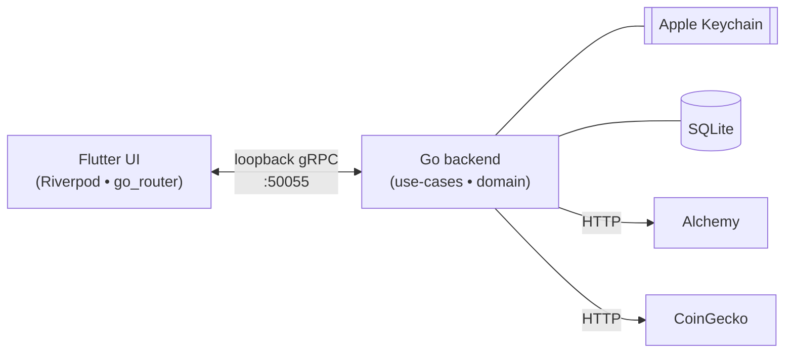

<div align="center">

# Nox Wallet

**A self-custodial Ethereum wallet for macOS.**

Native Flutter UI, Go backend, SQLite-backed state, Touch ID unlock, tray-resident operation.

[](docs/development.md#prerequisites)
[](go.mod)
[](ui/pubspec.yaml)
[](docs/architecture.md#what-this-architecture-intentionally-is-not)
[](#license)

</div>

---

## Overview



The Flutter app spawns the Go backend as a child process,
communicates over loopback gRPC, and runs entirely on the user's
laptop. No cloud, no telemetry, no remote config — the binary is the
whole product. See [`docs/architecture.md`](docs/architecture.md) for
the deep dive.

## Highlights

- **Manage funds** — generate a new wallet, import via
  mnemonic / private key / encrypted keystore. ETH + ERC-20 balances
  with USD valuations.
- **Send & swap** — single-step ETH sends, ERC-20 transfers, on-chain
  swaps through Uniswap V3. Speed-up / cancel for stuck transactions.
- **Track history** — Alchemy-driven sync of every transfer the
  wallet participates in. Multi-leg swaps merged into a single row.
- **Live notifications** — watcher streams events as they happen.
  Per-row read/unread state persists across restarts. Configurable
  macOS toasts + in-app chime.
- **Menu-bar mode** — the entire app collapses into a 380×660
  popover under the macOS tray icon — quick balance check, send /
  swap actions, notification panel, gas info — all without opening
  the full window.
- **Touch-ID lock** — biometric unlock on launch and after idle
  timeout. Single-shot re-prompt guard so window resize doesn't
  trigger Touch-ID storms.
- **Theme-aware** — dark / light mode with a runtime-swappable Dock
  icon bundled per theme.

## Quick start

```sh
git clone git@github.com:paxyside/nox-wallet.git
cd nox-wallet

cp config.example.yaml config.yaml
$EDITOR config.yaml                  # paste your Alchemy key
task proto:image                     # one-time Docker image for buf
task dev                             # build backend + run Flutter
```

For prerequisites (Go, Flutter, Task, golangci-lint, Docker) and the
account setup (Alchemy, CoinGecko), see
[`docs/development.md`](docs/development.md).

## Documentation

| Page                                           | What's there                                                                                                                            |
|------------------------------------------------|-----------------------------------------------------------------------------------------------------------------------------------------|
| [`docs/architecture.md`](docs/architecture.md) | System overview, process model, hexagonal layering, data flow, storage model, gRPC contract.                                            |
| [`docs/backend.md`](docs/backend.md)           | Go side: package layout, usecase summaries, watcher mechanics, Alchemy integration, ethkit, migrations, test coverage.                  |
| [`docs/frontend.md`](docs/frontend.md)         | Flutter side: feature-sliced structure, Riverpod conventions, send + swap state machines, notification model, native channels, gotchas. |
| [`docs/development.md`](docs/development.md)   | Setup, the `task` runner, pre-commit checks, CI overview, common gotchas.                                                               |
| [`SECURITY.md`](SECURITY.md)                   | How to report a vulnerability + posture summary.                                                                                        |
| [`CONTRIBUTING.md`](CONTRIBUTING.md)           | Code style, commit conventions, pre-push checklist.                                                                                     |
| [`CODE_OF_CONDUCT.md`](CODE_OF_CONDUCT.md)     | Behavioural ground rules.                                                                                                               |

## Security posture

- **Secrets** stay in the Apple Keychain (service name
  `nox-wallet`). Mnemonic and private key never touch SQLite, log
  output, or any file we write.
- **App sandbox** is on
  (`com.apple.security.app-sandbox` entitlement). Network client +
  server entitlements only.
- **gRPC is loopback-only** (`127.0.0.1:50055`). Sandbox plus the
  bind address keeps the port reachable only from the same user
  account.
- **Touch ID** required on app start and after idle timeout.
- **Reveal-secret RPC** requires the user to tap "Reveal" twice in
  the UI before mnemonic / private-key text is rendered.
- **No telemetry.** No crash reporting, no analytics, no remote
  logging. The only outbound calls are to Alchemy, CoinGecko (if a
  key is configured), and Etherscan (only when the user explicitly
  clicks a transaction tile).

Full detail in [`SECURITY.md`](SECURITY.md).

## Project status

v0, private, single developer, macOS-only, Ethereum-mainnet-only.
The roadmap toward multi-chain, multi-wallet, WalletConnect, and
a signed + notarized release lives in `todos/`.

## License

Proprietary. All rights reserved. This repository is private; no
license is granted to copy, modify, or redistribute the contents.
