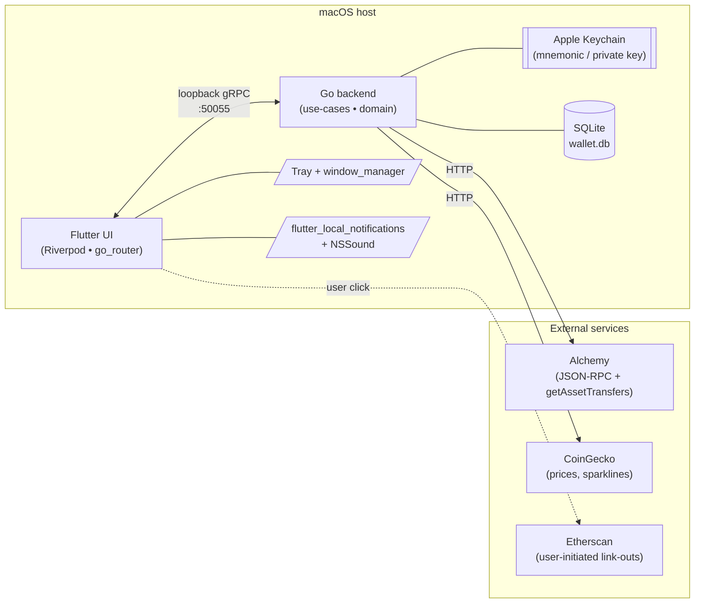
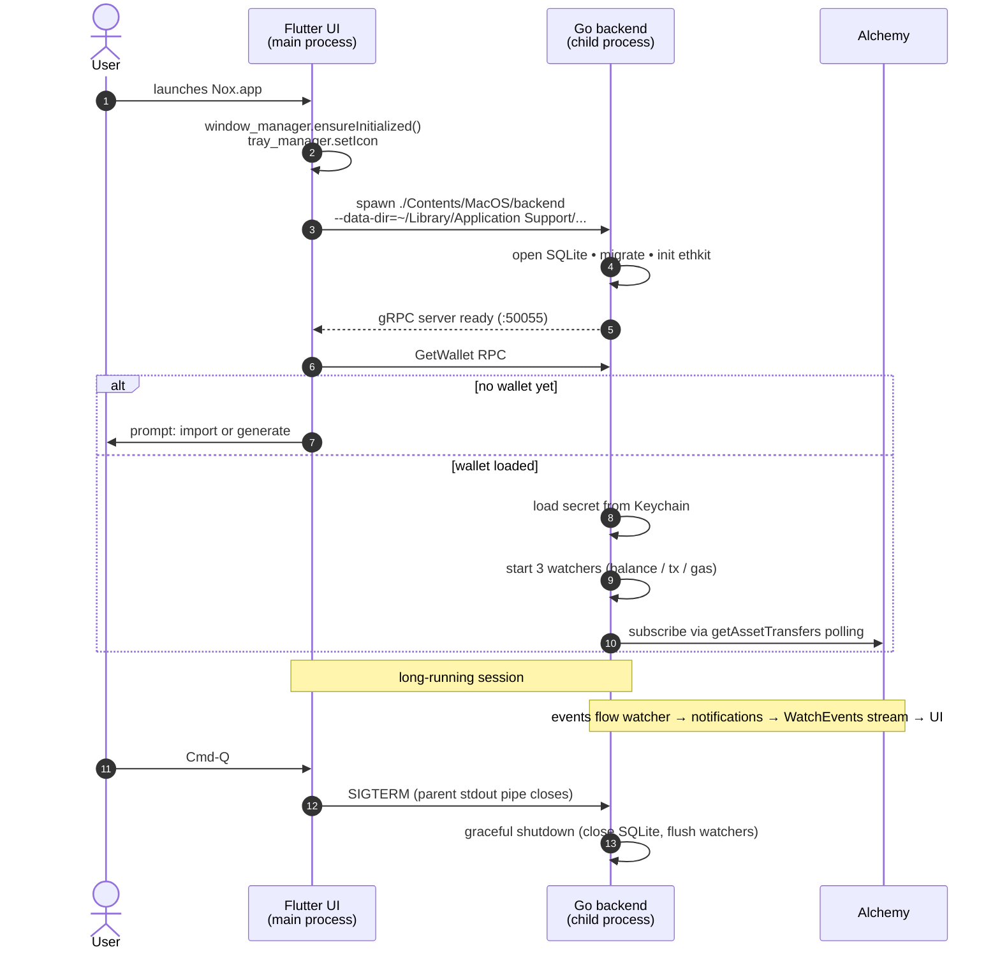
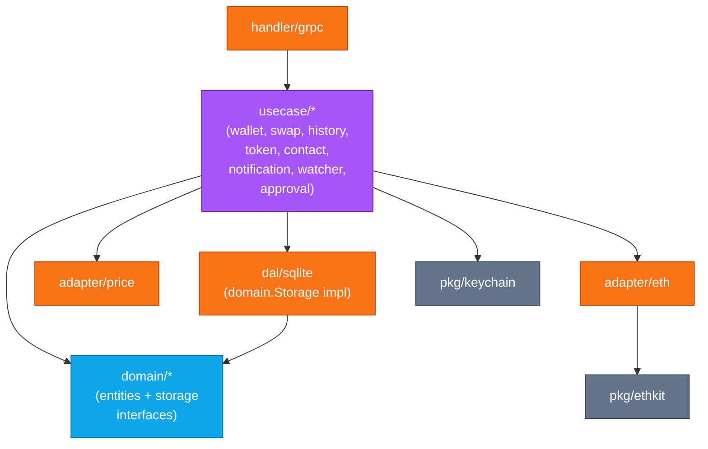
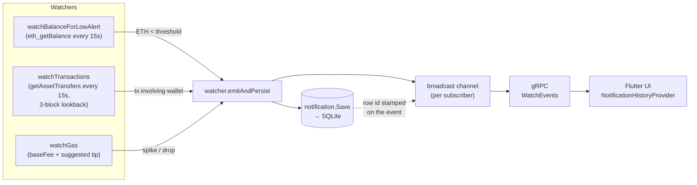
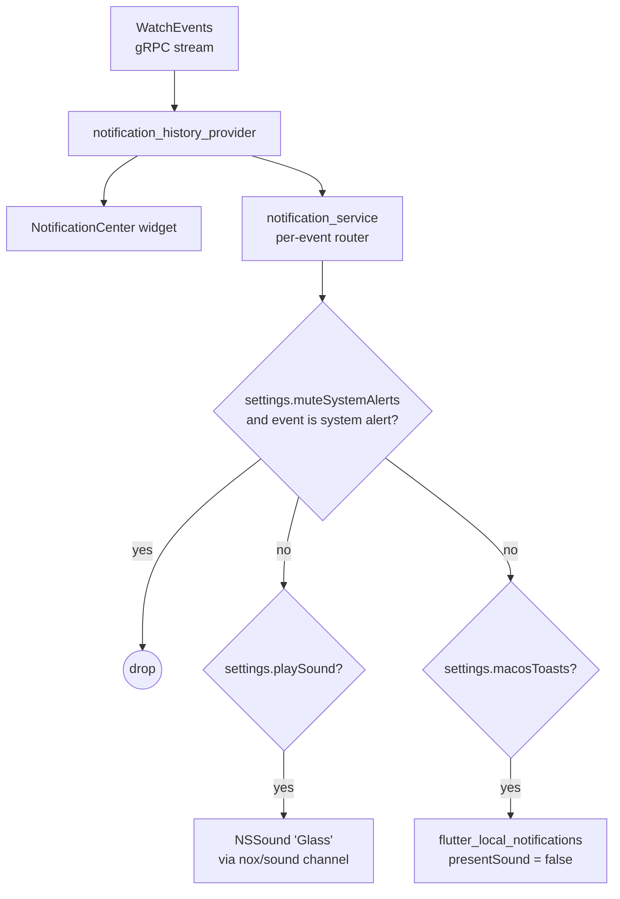

# Architecture

Nox Wallet is a desktop application: a native macOS Flutter UI talks
gRPC to a Go backend running as a sibling child process on
`127.0.0.1:50055`. State lives in SQLite; secrets live in the macOS
Keychain. There is no server in the cloud — the binary on the user's
laptop is the whole product.

## System overview



Three things make this layout work in practice:

- **Loopback gRPC** keeps the wire format the same as it would be for a
  client/server app, so adding remote-control later (e.g. mobile
  companion) is a config change, not a rewrite. Loopback + macOS app
  sandbox means the port isn't reachable from outside the user account.
- **Apple Keychain** is the only place mnemonic / private keys touch.
  SQLite never sees plaintext secrets. Even crash dumps and logs can't
  leak the key because the Go process holds it as a borrowed
  `*ethkit.Wallet` only for the duration of a `SendTx` / `Swap` call.
- **External calls are the bare minimum**: Alchemy for chain reads,
  CoinGecko for prices, Etherscan as a tx-explorer hyperlink target
  the user opens manually. No telemetry, no analytics, no remote
  config.

## Process model



Why a child process instead of FFI? Two reasons:

1. The watcher spawns dozens of long-lived goroutines (per-monitor
   polling loops, the pending-tx janitor, the SQLite write loop). FFI
   inside Flutter's event loop would either block the UI or require
   careful isolate routing for every cross-call. Child process + gRPC
   is structurally simpler.
2. Panics survive. If the Go side crashes, the Flutter app stays
   responsive and can prompt the user to restart the backend.

## Hexagonal layering on the backend

The Go side follows ports-and-adapters: the **usecase layer** is the
only one allowed to import both domain types and adapter
implementations. Domain entities don't know transport; adapters don't
know business rules.



Practical rules that come out of this layout:

- **`domain/*`** is pure Go — no imports from `internal/usecase/`,
  `internal/adapter/`, `pkg/grpckit`, or any framework. Just `time`,
  `errors`, and our own `pkg/errors`.
- **`internal/usecase/<name>`** declares its own `EthClient` /
  `Storage` interfaces. `adapter/eth` and `dal/sqlite` then satisfy
  whatever subset each usecase needs — no shared mega-interface.
- **`handler/grpc`** is allowed only one outbound dependency:
  `usecase/*`. It never touches a `domain.*` storage interface directly.

## Live-data flow

Three watchers run as goroutines after the wallet loads from Keychain.
Each has a single responsibility:



Two pieces of nuance worth knowing about:

- **Swap deferral.** When Alchemy sees only one leg of a swap on a
  given poll, the watcher checks the local pending-tx tracker: if that
  hash was submitted as a swap, the event is deferred up to 30 s
  waiting for the second leg. This is what stops the UI from showing
  "Sent USDC" and "Received USDT" as two separate notifications.
- **Row-id stamping.** `notification.Save` returns a freshly minted
  ULID. The watcher stamps it onto the `WalletEvent` before
  broadcasting, so the live stream and the cold-start
  `ListNotifications` hydration carry the same per-row identity. UI
  keys read/unread state off that id.

## Notification flow on the UI side



Three providers cooperate:

- `notification_history_provider` — per-row read/unread, hydrated from
  `ListNotifications` on launch, then live-prepended from `WatchEvents`.
- `notification_settings_provider` — single-row mirror of the
  `notification_settings` SQLite table (sound, toasts, mute, auto-mark,
  auto-delete-days).
- `notification_service` — orchestrator. The sound path is
  intentionally separate from the toast path: macOS toasts ship with
  `presentSound: false` so the in-app chime is the single source of
  audio (no double-beep).

## Storage model

Everything but secrets lives in one SQLite file:

```
~/Library/Containers/com.nox.wallet/Data/
  Library/Application Support/nox-wallet/wallet.db
```

(dev runs without `--data-dir` use `./.dev-data/wallet.db` instead.)

Schema highlights:

| Table                   | What it holds                                                                                                                                                                               |
|-------------------------|---------------------------------------------------------------------------------------------------------------------------------------------------------------------------------------------|
| `wallets`               | Address + label + secret_type (mnemonic vs private_key).                                                                                                                                    |
| `contacts`              | Address book, favorites, notes.                                                                                                                                                             |
| `watched_tokens`        | ERC-20 watchlist with pin/hide flags.                                                                                                                                                       |
| `transactions`          | History rows from Alchemy `getAssetTransfers` (one row per asset leg, deduped by `unique_id`).                                                                                              |
| `notifications`         | Persisted `WalletEvent` payloads (proto-bytes blob + tx_hash + kind + is_ours + is_read).                                                                                                   |
| `notification_settings` | Singleton row (id=1 CHECK constraint), holds the user's sound / toast / mute / auto-delete prefs.                                                                                           |
| `pending_txs`           | In-flight transactions surviving a backend restart, with a few-minute `removed_at` lingering window so the watcher can still associate freshly-mined hashes with their original `Kind` tag. |

Migrations are managed by [goose](https://github.com/pressly/goose).
We keep the entire schema in **one migration file** (`00001_init.sql`)
during v0; once the first release ships, subsequent changes go in
numbered migrations.

Secrets are stored under Keychain service name `nox-wallet`, with the
mnemonic / private-key string as the value. `task clean` wipes that
entry alongside the SQLite database.

## gRPC contract

- Server binds **`127.0.0.1:50055`** only.
- Single `WalletService` defined in `proto/wallet/service.proto`, with
  message types broken out into `proto/wallet/{balance,contact,common,event,swap,token,transaction,wallet}/*.proto`.
- Reflection enabled by default for `grpcurl`; flip
  `grpc.reflection: false` in `config.yaml` for release builds.
- Static-token auth available (`grpc.authorization` in config) but
  empty by default — when empty the auth interceptor short-circuits.
  Set to a shared secret if you want belt-and-braces over loopback.
- Streaming endpoint is `WatchEvents`, returning a stream of
  `NotificationEnvelope { id, is_read, event }` — the envelope shape
  is the same one `ListNotifications` returns, so the UI hydrates and
  the live stream from the same code path.

## What this architecture intentionally is NOT

- **Not multichain.** ETH mainnet only at v0. The
  `internal/usecase/wallet` and `pkg/ethkit` layers assume a single
  chain in many places. `todos/chainkit-prep.md` covers the rewrite
  that lifts this.
- **Not multi-wallet.** One loaded address at a time. The Keychain
  layer + SQLite schema both assume singletons. `todos/multi-wallet.md`
  covers it.
- **Not WalletConnect-compatible.** dApp signing requests are a v1
  concern — they need a hardened ABI decoder + sandboxed signing UX
  which we don't have yet.
- **Not crash-reporting-enabled.** No Sentry, no Crashlytics, no
  remote logging. If/when that changes it'll be a deliberate opt-in
  pull request, not a quiet add.
