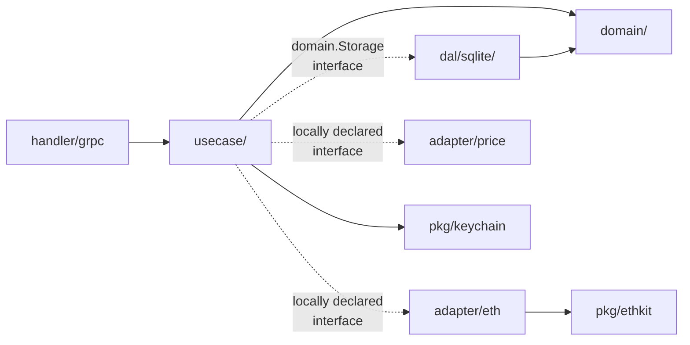
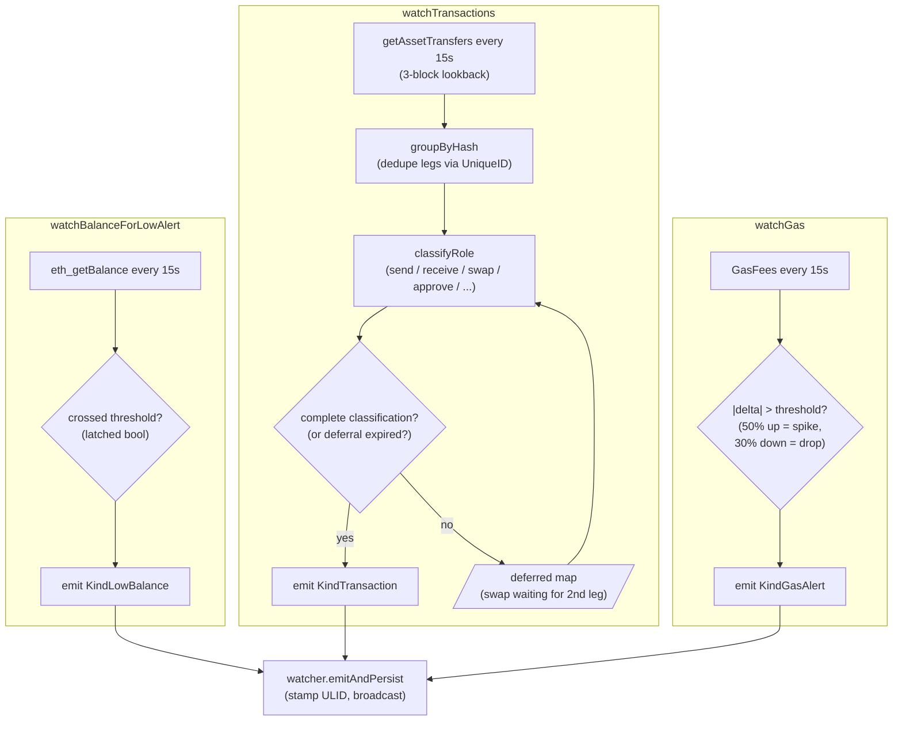

# Backend

The Go side. Bootstraps from `cmd/app/main.go`, exposes a gRPC
service on `127.0.0.1:50055`, and runs watchers + storage in the
same process. No external services beyond Alchemy and CoinGecko.

For the cross-cutting design, see
[`architecture.md`](architecture.md). This page goes one level
deeper into how each Go package is shaped.

## Module layout

```
cmd/app/                           backend entrypoint (flag parsing, signal wiring)
config/                            typed Config struct + Load helper
internal/
├── app/                           wiring + lifecycle (init, runners)
│   ├── app.go                     New() / Run() / shutdown
│   ├── init_infra.go              SQLite, ethkit, keychain, pending-store
│   ├── init_domain.go             usecase wiring (idx + clock + sinks)
│   └── runners/grpcserver/        gRPC server runner (start/serve/stop)
├── handler/grpc/                  gRPC transport adapters (Handler struct, RPCs)
├── usecase/                       business logic per domain
│   ├── base.go                    BaseUsecase mixin (IDx + Clock)
│   ├── wallet/                    generate, import, send, simulate, ENS
│   ├── swap/                      Uniswap V3 quote + execute
│   ├── history/                   Alchemy getAssetTransfers sync + history read
│   ├── token/                     watched-token CRUD + discover + USD-enriched list
│   ├── contact/                   address book
│   ├── approval/                  list + revoke ERC-20 approvals
│   ├── notification/              persist events + read settings (sink for watcher)
│   └── watcher/                   the three live watchers (balance / tx / gas)
├── domain/                        pure entities + storage interfaces
│   └── {wallet,contact,token,transaction,notification}/{entity,service,storage/sqlite}
├── adapter/                       external-system adapters
│   ├── eth/                       ethkit.Client → usecase EthClient interfaces
│   └── price/                     CoinGecko HTTP client with in-memory cache
└── dal/sqlite/
    ├── migrator.go                goose-backed Migrate(ctx, db)
    └── migrations/00001_init.sql  full schema (one file at v0)
pkg/
├── ethkit/                        wallet, swap, ERC-20, pending-tx tracker, ENS
├── sqlitekit/                     SQLite client + pragma setup
├── grpckit/                       server builder + standard interceptors
├── keychain/                      go-keyring wrapper (service = App.Name)
├── logger/                        slog wrapper (JSON / pretty handlers)
├── cache/                         tiny in-memory TTL cache (used by price feed)
├── errors/                        Code-tagged error type + ToGRPCError
└── common/{idx,timex,retryx}      ULID/UUID gen, system clock, exp backoff
```

## Bootstrap

`cmd/app/main.go` is intentionally thin:

1. Parse two flags: `--config` (path to YAML) and `--data-dir`
   (where the SQLite db lives). `--data-dir` falls back to
   `./.dev-data` for `task dev` runs.
2. Load config via `pkg/config.Load(WithConfigPaths(...))`.
3. Construct the logger from `cfg.Logger`.
4. `applayer.New(ctx, cfg, l, dataDir)` wires everything.
5. `application.Run(ctx)` blocks until SIGTERM / SIGINT.

`internal/app.New` follows a strict order: **infra → services →
gRPC server → runners list**. Adding a new usecase only requires
edits inside `init_domain.go` and `init_services.go` — handlers
pick up the new wire automatically.

## Hexagonal layering — the rule in one paragraph

The dependency arrow points inward: handlers depend on usecases,
usecases depend on domain types and on their own locally-declared
adapter interfaces, adapters satisfy those interfaces. **Domain
packages have zero imports from `internal/usecase`,
`internal/handler`, or `internal/adapter`**. Adapters depend on
upstream libraries (`pkg/ethkit`, drivers) and on the domain
storage interface they implement — never on usecases.



The crucial bit: each `usecase/<name>` declares **its own**
`EthClient`, `Storage`, etc. interfaces with only the methods it
needs. `adapter/eth.Adapter` then satisfies all of them. This
keeps tests focused (each fake is small) and avoids a single
mega-interface that becomes a dumping ground.

## Usecases — one bullet each

- **`wallet`** — generate / import / load via keychain, send ETH,
  send ERC-20, simulate, ENS forward / reverse, reveal-secret.
  Largest usecase; 524 lines.
- **`swap`** — Uniswap V3 quote + execute. Slippage is applied at
  the watcher boundary, not here — this layer just returns
  `SwapQuote` with `amountOut` and lets the caller pass
  `amountOutMin`.
- **`history`** — pull-based sync against Alchemy
  `getAssetTransfers`. Uses `errgroup` + `golang.org/x/sync/semaphore`
  (cap = 8 concurrent in-flight) for parallel category fetches +
  a single-flight gate so two concurrent UI refreshes don't double-fetch.
- **`token`** — watchlist CRUD; `ListWithBalances` enriches each
  watched token with on-chain balance, USD price (from
  `adapter/price`), 24-hour change, and a 7-day sparkline.
- **`contact`** — address book. Plain CRUD + favorite flag.
- **`approval`** — list + revoke ERC-20 approvals. Reads from
  Alchemy + on-chain `allowance()` calls.
- **`notification`** — persistence sink for the watcher. Owns
  `notification_settings` (singleton row). `SweepOnStartup`
  prunes rows older than `auto_delete_days`.
- **`watcher`** — the three live monitors (covered below).

## Watcher mechanics

`internal/usecase/watcher` is the most subtle part of the backend.
It runs three goroutines:



A few non-obvious invariants:

- **`emittedSet`** is a bounded LRU keyed by tx hash. Stops
  duplicate notifications when Alchemy's 3-block lookback overlaps
  consecutive polls.
- **`deferred map`** is keyed by tx hash, value is the timestamp
  the entry was first deferred. After `maxDeferral` (30 s) the
  watcher emits whatever's available even if the swap classification
  is incomplete — better wrong-once than never.
- **`PendingChecker.RecentPendingForAddress`** lets the watcher see
  hashes that the pending tracker dropped a few minutes ago. Needed
  because the watcher polls every 15 s and Ethereum mines every ~12 s
  — without the lookback window we'd lose `Kind="swap"` tags on
  txs that mined right after `waitForReceipt` returned.
- **`PendingStore`** is a SQLite-backed alternative to the
  in-memory `pendingTracker` in ethkit. Wired via
  `ethkit.WithPendingStore` so the `Kind` tag for a swap survives
  a backend restart.

## Alchemy integration

Lives in `pkg/ethkit/alchemy.go`. We use four endpoints:

- `alchemy_getAssetTransfers` — the canonical transaction source.
  Paginated, supports both directions, categories, and a block
  range. The watcher polls this every 15 s with a 3-block window;
  the history usecase uses it for full sync.
- `alchemy_getTokenBalances` — discover ERC-20 tokens with non-zero
  balance. Used by the token usecase to auto-seed the watchlist on
  first launch.
- `alchemy_getTokenMetadata` — name / symbol / decimals for an
  arbitrary contract. Used to enrich Alchemy transfer rows where
  the API didn't return token metadata inline.
- `alchemy_getLogo` (via `getTokenMetadata`) — CDN logo URL. Empty
  string ⇒ UI falls back to a letter avatar.

The HTTP client wrapping this has a `retryx.Retrier` configured
with 3 retries, 500 ms base delay, exponential backoff. Most Alchemy
errors are transient (rate limits or 502s) and recover within a
single backoff cycle.

## SQLite migrations

`internal/dal/sqlite/migrator.go` is a 30-line wrapper around goose.
On startup `applayer.New` calls it; goose reads from
`migrations/00001_init.sql` (embedded via `//go:embed`) and applies
any pending migrations. We keep everything in **one file** during
v0 — the schema is still in flux and adding numbered migrations for
breaking changes would be noise. Once the first release ships,
subsequent changes go in `00002_*.sql`, `00003_*.sql`, etc.

The single migration creates: `wallets`, `contacts`, `watched_tokens`,
`transactions`, `notifications`, `notification_settings`, `pending_txs`.
Indexes follow the access patterns: `transactions(timestamp DESC)`,
`notifications(is_read, created_at DESC)`, `pending_txs(removed_at)`
for the GC sweep.

## ethkit — the wallet library

`pkg/ethkit` is the lowest-level Go library in the project. It
wraps go-ethereum's `ethclient` with:

- **Connection management** — HTTP only (we removed the WS path
  along with the dead `SubscribeNewBlocks`). Reconnects are
  unnecessary because every call goes through `Retrier`.
- **Wallet** — derive from mnemonic (BIP-39 + BIP-44 path),
  from raw private key hex, or import from a JSON keystore. Address
  derivation is lazy; the loaded `Wallet` holds the private key only
  while a Send/Swap call is in flight.
- **Pending tracker** — keeps in-flight txs in memory so the
  watcher can correlate freshly-mined hashes with the original
  `Kind` tag (swap / send / approve / cancel). Has a `recent` map
  with a TTL so dropped entries are still visible for a few minutes.
- **ENS** — forward (`name → address`) and reverse
  (`address → name`) via the canonical resolver contract.
- **Swap** — Uniswap V3 quote (`QuoteV2`) and execute
  (`SwapRouter02`) with allowance management.
- **Gas estimation** — `GasFees` returns baseFee + suggested
  priorityFee; `GasEstimateWithFees` runs an eth_estimateGas and
  multiplies by the resolved tip.

ethkit is intentionally consumable as a library: it has its own
`Logger` interface (no dependency on our `pkg/logger`), its own
`Retrier` interface (no dependency on `pkg/common/retryx`), and the
nonce manager is per-`Client` so two clients in the same process
don't fight over the same address.

## Test coverage

| Package                                   | Coverage | What's tested                                                     |
|-------------------------------------------|----------|-------------------------------------------------------------------|
| `internal/usecase/contact`                | 100%     | full CRUD + favorite + delete-cascade rules                       |
| `internal/usecase/swap`                   | 85%      | quote routing, slippage, error paths                              |
| `internal/usecase/notification`           | 80%      | save + auto-mark-read + auto-delete sweep + settings              |
| `internal/usecase/history`                | 68%      | sync pagination, single-flight, dedup                             |
| `internal/usecase/watcher`                | 45%      | classify, emittedSet, swap deferral, process_tick                 |
| `internal/handler/grpc`                   | 24%      | zero-address guards, notification mapping, error envelope         |
| `internal/usecase/wallet`                 | 28%      | mostly hard to fake (cgo + keychain)                              |
| `internal/usecase/token`                  | 34%      | watch list CRUD; price-feed enrichment is integration             |
| `pkg/ethkit`                              | 9%       | mostly RPC-bound; what's tested is amount math + classify helpers |
| `pkg/common/{idx,retryx}`                 | ~90%     | small surface                                                     |
| `pkg/errors`, `pkg/config`, `pkg/grpckit` | 40-60%   | error mapping, interceptor behaviour                              |

The numbers are honest — they reflect what's worth testing vs what's
just RPC plumbing. The wallet usecase + ethkit are heavy on
network-bound calls; covering them would mean a fake Ethereum node
in CI which we haven't built yet.

## Linting

`golangci-lint run --fix` is the gate. Config in `.golangci.yaml`
turns on the relevant subset (no `dupl`, no `gomnd`, etc., that
would create noise without finding real bugs). Test files are
exempted from `funlen`, `gocognit`, `goconst`, `gocritic`, `dupl`,
`gosec`, `noctx`, `wrapcheck`, `cyclop` — test fakes legitimately
have repetitive structure and the lint rules were designed for prod
code.

`deadcode ./...` is run separately; today it reports zero unreachable
exported functions across the whole module.
