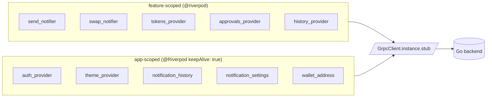
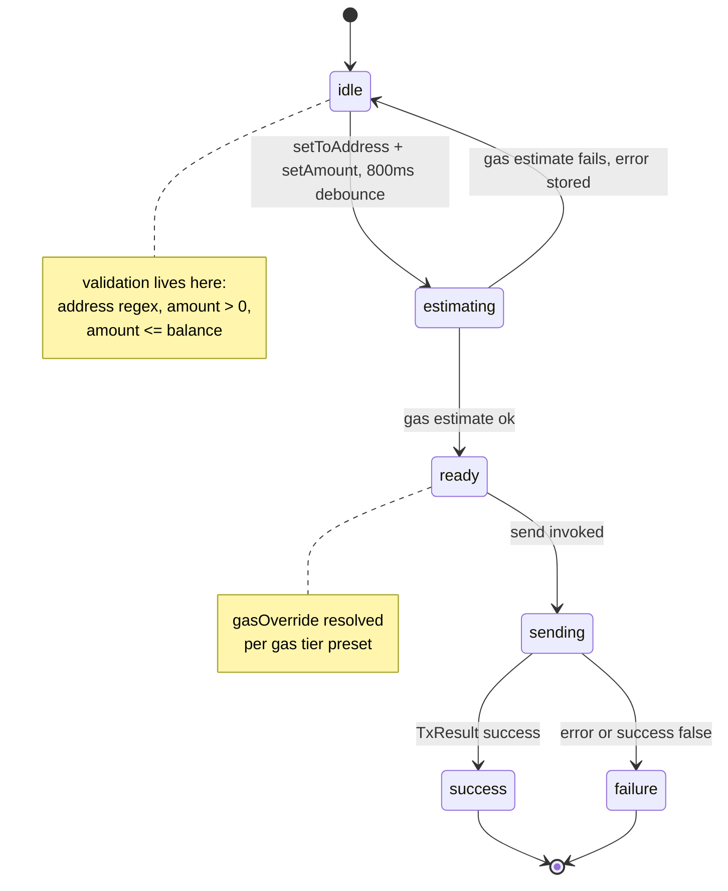
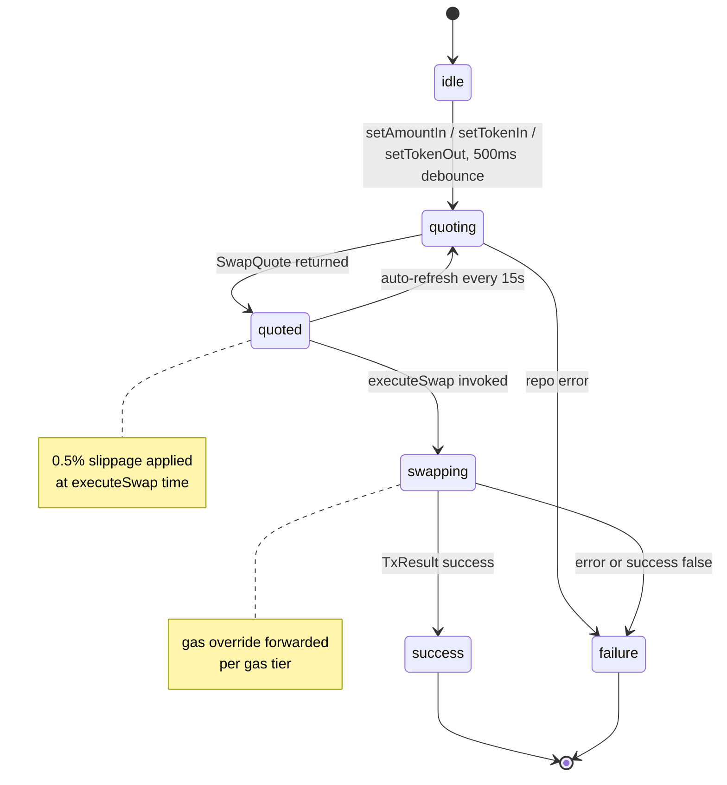
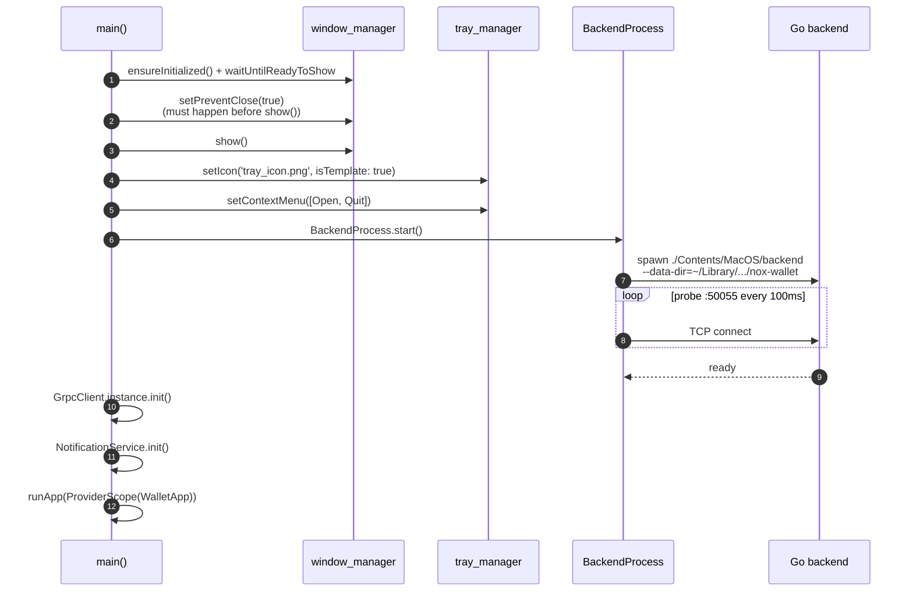
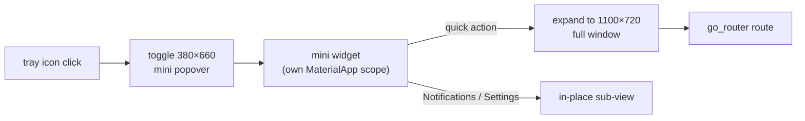

# Frontend

Flutter macOS desktop app. Speaks gRPC to a Go backend running as a
sibling child process on `127.0.0.1:50055`. Riverpod for state,
go_router for navigation, `flutter_local_notifications` for macOS
toasts, NSSound (via method channel) for the in-app chime.

For the big-picture system view, see
[`architecture.md`](architecture.md). For day-to-day commands, see
[`development.md`](development.md). This page is about how the
Flutter code is shaped.

## Layout

```
ui/
├── lib/
│   ├── main.dart                     entry — window, tray, backend boot
│   ├── core/                         cross-cutting concerns
│   │   ├── backend/                  child-process spawner for the Go binary
│   │   ├── balance/                  GasStats, BalanceData domain types
│   │   ├── ens/                      ENS resolution provider
│   │   ├── gas/                      gas-fee estimation helpers
│   │   ├── network/                  gRPC client singleton + interceptors
│   │   ├── router/                   GoRouter config + Routes constants
│   │   ├── services/                 app-wide services
│   │   │   ├── notification_service          macOS toasts (silent)
│   │   │   ├── notification_history_…        per-row read/unread cache
│   │   │   ├── notification_settings_…       sound / toasts / mute / auto-delete
│   │   │   ├── notification_copy             single source of notification text
│   │   │   ├── sound_service                 NSSound chime via nox/sound channel
│   │   │   └── app_icon_service              theme-swap Dock icon
│   │   ├── state/                    auth, privacy, wallet-address providers
│   │   ├── theme/                    colours, typography, theme provider
│   │   ├── utils/                    formatAmount, timeAgo, formatters, …
│   │   ├── wallet_events/            WatchEvents stream + envelope mapping
│   │   └── widgets/                  shared widgets (dialogs, snackbars, …)
│   └── features/<name>/              feature-sliced clean architecture
│       ├── data/                     gRPC repos, proto ↔ domain mappers
│       ├── domain/                   pure entities + repository contracts
│       └── presentation/
│           ├── providers/            feature-level Riverpod providers
│           ├── screens/              top-level screens (routes)
│           └── widgets/              feature-scoped widgets
├── macos/Runner/                     native macOS code
│   ├── AppDelegate.swift             nox/app_icon + nox/sound method channels,
│   │                                 tray-resident behaviour (red-X hides)
│   ├── Assets.xcassets/              AppIcon (universal) + AppIconLight /
│   │                                 AppIconDark (theme-swappable Dock)
│   └── Runner.entitlements           Sandbox + network client/server only
├── packages/wallet_proto/            generated proto Dart bindings (path-imported)
├── pubspec.yaml
├── analysis_options.yaml             very_good_analysis preset
└── test/
    ├── widget_test.dart              app smoke test
    ├── core/utils/*_test.dart        format / formatter unit tests
    └── features/{send,swap}/         state-machine unit tests
```

Twelve feature modules under `lib/features/`: `approvals`, `contacts`,
`history`, `home`, `lock`, `menubar`, `notifications`, `onboarding`,
`send`, `settings`, `swap`, `tokens`. Each owns its `data`, `domain`,
and `presentation` slices. Cross-cutting state (auth, theme,
notification history) lives in `core/`.

## State model



The conventions:

- **Riverpod** (`flutter_riverpod` + `riverpod_annotation`) is the
  only state-management story. Code generation handles the
  boilerplate — rerun `dart run build_runner build` after changing
  any provider annotation. Generated files (`*.g.dart`,
  `*.freezed.dart`) are checked in so the prepare pipeline doesn't
  have to regenerate to verify.
- **`@riverpod`** for ephemeral providers (recreate on widget tree
  rebuild). **`@Riverpod(keepAlive: true)`** for app-scoped state
  that must survive navigation (auth, theme, notification history,
  notification settings).
- **`AsyncValue`** at the gRPC boundary — every repo that hits the
  backend exposes data through `AsyncNotifier` so loading / error
  states surface without manual try/catch in widgets.

## Send + Swap state machines

These two are the highest-stakes flows (money on the line) and the
only state machines we've covered with unit tests.





Both notifiers are covered in `test/features/{send,swap}/*_test.dart`
— 48 tests total. The covered surface is the deterministic part
(validation predicates, state transitions, gas-tier math, slippage
application). The debounced timers and the auto-refresh loop are out
of scope — those belong in integration tests.

## Notification model

Three providers cooperate. The split exists because **persistence,
preferences, and side effects shouldn't be coupled** — a user
toggling "play sound" off shouldn't lose their unread history.

| Provider                         | Role                                                                                                                                         | Lifetime   |
|----------------------------------|----------------------------------------------------------------------------------------------------------------------------------------------|------------|
| `notification_history_provider`  | per-row read/unread state synced to the backend; hydrates from `ListNotifications` on boot, then prepends from the live `WatchEvents` stream | app-scoped |
| `notification_settings_provider` | sound / toasts / mute-system / auto-mark-read / auto-delete-days; single-row mirror of the server's `notification_settings` table            | app-scoped |
| `notification_service`           | orchestrator: per event, consults settings and routes to the OS toast + chime paths                                                          | app-scoped |

Per-event flow inside `notification_service`:

1. If `event.kind` is a system alert (gas / low balance) and
   `settings.muteSystemAlerts` is true → drop.
2. If `settings.playSound` → `SoundService.playChime()` (NSSound
   "Glass" via the `nox/sound` method channel).
3. If `settings.macosToasts` → `flutter_local_notifications.show()`
   with `presentSound: false` — always, because the chime is the
   single source of audio. Letting the toast play its own sound
   would produce a double-beep.

The notification center
(`features/notifications/.../notification_center.dart`) reads from
these providers and offers Mark-all-read / Clear-all / per-tile
mark-read actions, plus a settings panel.

## Native channels

Two method channels, both invoked from Dart and handled in
`ui/macos/Runner/AppDelegate.swift`:

| Channel        | Method                     | What it does                                                                                                                            |
|----------------|----------------------------|-----------------------------------------------------------------------------------------------------------------------------------------|
| `nox/app_icon` | `setTheme(bool isDark)`    | swap the Dock icon between `AppIconLight` and `AppIconDark` imageset bundles. Driven from the `theme_provider` listener in `main.dart`. |
| `nox/sound`    | `playChime({String name})` | play the named macOS system sound through `NSSound`. Default `"Glass"`. Single source of in-app audio.                                  |

`AppDelegate.applicationShouldTerminateAfterLastWindowClosed`
returns `false` so a red-X / `Cmd-W` only hides the window. **`Cmd-Q`
still quits.**

## Backend lifecycle

`main()` spawns the bundled Go backend through
`BackendProcess.start()`, waits for `127.0.0.1:50055` to become
ready (TCP probe loop), then connects the singleton `GrpcClient`.



Two subtleties that have bitten us:

- **`setPreventClose` must happen BEFORE `show()`**. Otherwise, a
  user fast enough to hit the red-X before the post-show callback
  fires bypasses the hide-instead-of-quit handler and the whole
  process exits, taking the tray icon with it.
- **The macOS process tree owns the backend**. Closing the window
  (tray-hide) doesn't kill it; `Cmd-Q` does. The Go side listens on
  the parent's stdout pipe and exits when it closes.

## Tray-resident pattern



The mini popover lives in **its own `MaterialApp` scope** (no
router) so forwarding to a real route uses callbacks
(`onOpenAt`, `onOpenNotificationCenter`) plumbed from `main.dart`.
That's why you'll see `final void Function(String)? onOpenAt` props
on widgets near the menubar — the alternative (a global navigator
key) would couple the mini world to the full world tighter than we
want.

## Theming + Dock icon swap

Theme state lives in `theme_provider` (`@Riverpod(keepAlive: true)`).
A listener in `main.dart` watches the resolved `ThemeMode` and
calls `AppIconService.setTheme(isDark)`, which routes through the
`nox/app_icon` method channel. macOS doesn't auto-mask app icon
images — the PNG itself has to bake in the squircle shape with ~10%
margin and ~22% corner radius. `AppIconLight` / `AppIconDark`
imagesets ship 512 + 1024 sizes; the universal `AppIcon` ships the
full 16 / 32 / 64 / 128 / 256 / 512 / 1024 ladder.

## Generated code workflow

Runs `riverpod_generator`, `freezed`, `json_serializable`,
`go_router_builder`. After editing any annotated source:

```sh
cd ui && dart run build_runner build --delete-conflicting-outputs
```

Generated files (`*.g.dart`, `*.freezed.dart`) are committed so
`task prepare` doesn't have to regenerate before linting and
testing. CI verifies these are up-to-date via
`git diff --exit-code` after `task prepare`.

## Common gotchas

- **`riverpod` ref after dispose** — newer riverpod invalidates
  `ref` during the Element's `unmount` phase, before the State's
  `dispose`. Cache notifier references in `build`
  (`_notifier ??= ref.read(...)`) and use the cached one in
  `dispose`. See `send_screen.dart` for the pattern.
- **Touch ID re-prompt loops** — only auto-prompt when
  `lockPromptPendingProvider.consume()` returns true. Window resize
  / mini-mode mounts re-mount LockScreen but should NOT re-prompt.
- **`hasTimestamp()` lying** — proto3 marks `Timestamp` as set even
  when the value is the zero epoch. Treat
  `millisecondsSinceEpoch <= 0` as "missing" and substitute
  `DateTime.now()`.
- **HardwareKeyboard `_pressedKeys` assertion spam** — upstream
  Flutter bug (#136419) emits stack traces when Cmd-key focus jumps
  between TextField + dialogs. `main.dart` filters that exact
  assertion in `FlutterError.onError`; other exceptions pass through.
- **macOS Dock icon shape** — see "Theming" above; macOS does NOT
  auto-mask, the PNG has to bake the squircle.
- **`window_manager.setResizable(false)`** is intentional — the
  full window is a fixed 1100×720 and the mini popover is a fixed
  380×660. The layout was not designed for arbitrary sizes; resize
  would have to be a deliberate v1+ feature.

## Code style

- **`very_good_analysis` 10.x** preset. Stricter than the Flutter
  default — flags missing `awaits`, missing trailing commas, dead
  code, `print` in production code, etc.
- **`dart format --line-length=100`**. The `--set-exit-if-changed`
  flag in `task prepare` makes it a hard gate; CI fails if any file
  is unformatted.
- **No `_` underscore prefix on public types** — Dart convention
  uses underscore for library-private symbols, and we follow it.
  Private widgets that exist only inside one file are
  underscore-prefixed and reached via `part`/`part of` rather than
  exposed publicly.
